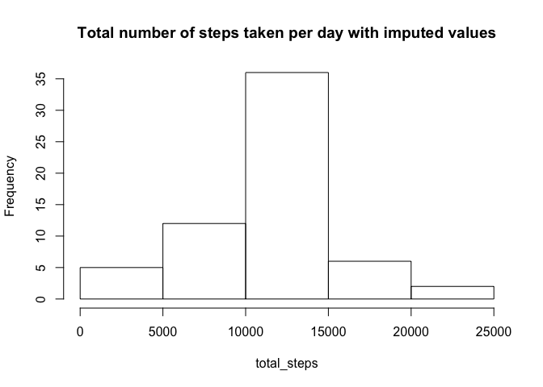

# Reproducible Research: Peer Assessment 1
`r Sys.Date()`  


## Loading and preprocessing the data

```r
unzip('activity.zip')
list.files()
```

```
## [1] "activity.csv"       "activity.zip"       "doc"               
## [4] "instructions_fig"   "PA1_template_files" "PA1_template.html" 
## [7] "PA1_template.md"    "PA1_template.Rmd"   "README.md"
```

```r
df <- read.csv("activity.csv")
head(df)
```

```
##   steps       date interval
## 1    NA 2012-10-01        0
## 2    NA 2012-10-01        5
## 3    NA 2012-10-01       10
## 4    NA 2012-10-01       15
## 5    NA 2012-10-01       20
## 6    NA 2012-10-01       25
```
The categories are steps, date, and interval. The dataset appears to contain NAs in the steps category. Let's run a summary.

```r
summary(df)
```

```
##      steps                date          interval     
##  Min.   :  0.00   2012-10-01:  288   Min.   :   0.0  
##  1st Qu.:  0.00   2012-10-02:  288   1st Qu.: 588.8  
##  Median :  0.00   2012-10-03:  288   Median :1177.5  
##  Mean   : 37.38   2012-10-04:  288   Mean   :1177.5  
##  3rd Qu.: 12.00   2012-10-05:  288   3rd Qu.:1766.2  
##  Max.   :806.00   2012-10-06:  288   Max.   :2355.0  
##  NA's   :2304     (Other)   :15840
```
There are quite a few NAs in the steps measurements, but no issues with the date/interval measurements.

## What is mean total number of steps taken per day?
Let's calculate this without considering the days with NA steps (probably when the tracker was inactive).

```r
# First calculate total steps per day
total_steps <- tapply(df$steps, df$date,sum)
mean_steps <- mean(total_steps, na.rm=TRUE)
hist(total_steps, main="Total number of steps taken per day")
```

<!-- -->
The mean number of steps taken per day is 10766.19 steps and the median is 10765 steps.

## What is the average daily activity pattern?
Here, we will plot daily pattern as determined by the interval variable. Interval is reflection of time throughout the day.

```r
library(ggplot2)

qplot(interval, steps, data=df)+geom_point(color='black')+geom_smooth(aes(color='loess'), se=TRUE)+stat_summary(fun.y=mean, geom='line', aes(color='mean'))+scale_color_manual(name='Summaries',values=c("dodgerblue","red"))+theme_bw()
```

```
## Warning: Removed 2304 rows containing non-finite values (stat_smooth).
```

```
## Warning: Removed 2304 rows containing non-finite values (stat_summary).
```

```
## Warning: Removed 2304 rows containing missing values (geom_point).

## Warning: Removed 2304 rows containing missing values (geom_point).
```

<!-- -->

```r
mean_pattern <- tapply(df$steps,df$interval, function(x) mean(x, na.rm=TRUE))
max_int <- names(mean_pattern)[which.max(mean_pattern)]
```
This is all of the step data plotted by interval, with a loess fit in blue and the mean in red. On average, the interval at 835 contains the max number of steps, removing NAs.

## Imputing missing values


```r
missing <- sum(is.na(df)) # is.na returns T, or 1, for each missing value
```
The total number of missing values is 2304. Let's try to impute the missing data.

```r
# Let's replace missing data by the mean for that interval
# First, recast data in wide form
df_reshape <- reshape(df, timevar="interval",idvar="date", direction="wide")
rownames(df_reshape) <- df_reshape$date; df_reshape[1] <- NULL
colnames(df_reshape) <- sapply(colnames(df_reshape),function(x) strsplit(x,"[.]")[[1]][2])

# Now look up missing values by the column name
missing <- which(is.na(df_reshape), arr.ind=TRUE)
df_reshape[missing] <- mean_pattern[missing[,2]] # replace by mean steps in that interval

total_steps <- rowSums(df_reshape) # total steps for each day
mean_steps <- mean(total_steps)
hist(total_steps, main="Total number of steps taken per day with imputed values")
```

<!-- -->
Using the imputed data, the mean number of steps taken per day is 10766.19 steps and the median is 10766.19 steps. This is significantly different from the non-imputed data.


## Are there differences in activity patterns between weekdays and weekends?
Let's first group all measurements into whether they were taken on a weekday or weekend.

```r
library(chron)
df$day <- factor(is.weekend(as.Date(df$date)),labels = c("Weekday","Weekend"))
qplot(day, steps,data=df)+geom_boxplot()+ggtitle("Step measurements by type of day")
```

```
## Warning: Removed 2304 rows containing non-finite values (stat_boxplot).
```

```
## Warning: Removed 2304 rows containing missing values (geom_point).
```

<!-- -->
This is probably not the best way to measure activity patterns. Let's try to plot patterns throughout the day by type of day in a stacked plot.

```r
qplot(interval, steps, data=df, facets=day~.)+geom_point(color='black')+geom_smooth(aes(color='loess'), se=TRUE)+stat_summary(fun.y=mean, geom='line', aes(color='mean'))+scale_color_manual(name='Summaries',values=c("dodgerblue","red"))+theme_bw()
```

```
## Warning: Removed 2304 rows containing non-finite values (stat_smooth).
```

```
## Warning: Removed 2304 rows containing non-finite values (stat_summary).
```

```
## Warning: Removed 2304 rows containing missing values (geom_point).

## Warning: Removed 2304 rows containing missing values (geom_point).
```

<!-- -->
There seems to be less movement at the start of the day on weekends, and slightly less movement overall.
